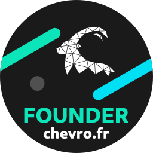

## 👋, cestoliv

<p><em>👨‍💻Développeur la plupart du temps</em><br>
<em>📷Vidéaste sur Youtube</em><br>
<em>✏️Quelques fois designer</em><br>
<em>🏫Et le reste de temps, lycéen</em><br>

[](https://cestoliv.com)
[](https://twitter.com/cestoliv)
[](https://www.youtube.com/channel/UCIVzban_FWu6idGf2rwSzlg)

```javascript
var cestoliv = {
  name: "Olivier" | "Oliv" | "CESTOLIV"
  contact: {
    mail: "cestoliv@chevro.fr",
    twitter: "@cestoliv"
  }
  
  code: {
    Javascript: {
      Frontend: ["VueJs"],
      Backend: {
        NodeJs: ["Express", "EJS"]
      }
    },
    
    Python: {
      Scripting: true,
      GUI: ["Tkinter", "GTK"]
    },
    
    C_plus_plus: {
      Scripting: true,
      GUI: ["Qt"]
    }
    
    Databases: [
      "MongoDB",
      "MySQL"
    ]
  }
  
  technologies: [
    "Linux",
    "Docker"
  ]
```

### Hi there 👋

<!--
**cestoliv/cestoliv** is a ✨ _special_ ✨ repository because its `README.md` (this file) appears on your GitHub profile.

Here are some ideas to get you started:

- 🔭 I’m currently working on ...
- 🌱 I’m currently learning ...
- 👯 I’m looking to collaborate on ...
- 🤔 I’m looking for help with ...
- 💬 Ask me about ...
- 📫 How to reach me: ...
- 😄 Pronouns: ...
- ⚡ Fun fact: ...
-->
